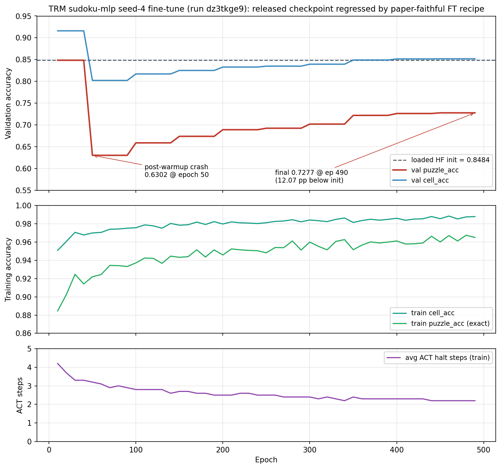

# Run dz3tkge9 — TRM-MLP Sudoku fine-tune regression analysis

**Run**: `trm_official_sudoku_seed4_STU-CZC5277FFS_1776872189`
**W&B**: <https://wandb.ai/shamykyzer/TRM/runs/dz3tkge9>
**Started**: 2026-04-22 16:36:30 UTC
**Last activity**: 2026-04-23 16:06:51 (silently terminated mid-eval, ~23.5 h wall-clock)
**Host**: STU-CZC5277FFS — RTX 5070 (Blackwell, 12.8 GB), Intel i7-14700, Windows 11
**Git commit at launch**: `5e9bdb0a8cb01964ee51c706d73d5049fb46fb80`

## Headline

Fine-tuning the released TRM-MLP Sudoku checkpoint with the paper-faithful
from-scratch config **regressed** its validation puzzle accuracy from
**0.8484 → 0.7277** (a 12.07 pp gap) over 480 epochs of training. `best.pt`
on disk is effectively the loaded init — it was last written ~2 h into the
run when the very first eval set the bar at 0.8484, and **no subsequent eval
beat it**. 23.5 h of wall-clock, 5.03 kWh, and 1.20 kg CO₂eq produced no
useful artifact.



(See `scripts/plot_sudoku_mlp_finetune_failure.py` to regenerate.)

## How the run was launched

```bash
python main.py \
  --mode train \
  --config configs/trm_official_sudoku_mlp.yaml \
  --seed 4 \
  --init-weights C:\Users\amm-alshamy\OneDrive - UWE Bristol\Documents\ML-TRM\hf_checkpoints\Sudoku-Extreme-mlp\remapped_for_local.pt \
  --epochs 1000
```

`--init-weights` triggers `_load_init_weights` (`src/training/trainer_official.py:465-499`)
which loads the model state-dict only (optimizer / global_step / EMA stay
fresh) and then calls `_reseed_ema_shadow("post-init-weights")` to rebuild
the EMA shadow in fp32 from the loaded weights. The downstream eval at
line 1038 calls `self.ema.apply_shadow()` first, so all val_* numbers
in the CSV reflect EMA-smoothed weights, not the raw model.

## What the metrics show

Source: `wandb/run-20260422_163630-dz3tkge9/files/trm_official_sudoku_train_log.csv`
(also at `C:/ml-trm-work/sudoku-mlp-seed4/trm_official_sudoku_train_log.csv`)

| epoch | lm_loss | train exact_acc | avg ACT steps | val cell_acc | val puzzle_acc | best | wall (min) |
|------:|--------:|----------------:|--------------:|-------------:|---------------:|-----:|-----------:|
|    10 |    3.73 |           0.885 |           4.2 |    **0.916** |      **0.848** | 0.848 |        120 |
|    50 |    2.20 |           0.922 |           3.2 |        0.802 |      **0.630** | 0.848 |        139 |
|   100 |    1.75 |           0.937 |           2.8 |        0.817 |          0.659 | 0.848 |        277 |
|   200 |    1.51 |           0.946 |           2.5 |        0.833 |          0.689 | 0.848 |        554 |
|   300 |    1.29 |           0.960 |           2.4 |        0.839 |          0.702 | 0.848 |        831 |
|   400 |    1.18 |           0.961 |           2.3 |        0.852 |          0.726 | 0.848 |       1108 |
| **490** | 1.07 |           0.965 |           2.2 |        0.852 |      **0.728** | **0.848** |   **1380** |

Three signals stack into the same story:

1. **Cliff at epoch 50**, exactly when LR finishes the 2000-step warmup (240
   steps/epoch × 13 epochs ≈ 3120 steps). The model lands off-optimum the
   moment LR reaches peak.
2. **Train↑ / val↓ divergence**: train exact_acc climbs 0.885 → 0.965 while
   val puzzle_acc *never* re-reaches the init's 0.848. Standard overfitting
   signature, but unusually severe given a converged starting point.
3. **avg_steps collapses 4.2 → 2.2**: the ACT halt head learns to halt
   earlier on the train distribution. Eval ignores ACT (full
   `halt_max_steps=16` per `trainer_official.py:1087`), so this doesn't
   directly hurt eval depth, but it confirms the halter is being pulled out
   of the regime it was pretrained in.

`best.pt` mtime (`2026-04-22 18:32`, ~2 h into the run, after epoch 10's eval)
hasn't moved since — the artifact on disk *is* a smoothed copy of the loaded
init weights. Nothing the fine-tuner did was worth saving.

## Run state — terminated, not running

- `output.log` and `run-dz3tkge9.wandb` both stop writing at 16:06 on
  Apr 23. No clean shutdown record.
- `emissions.csv` last row at 15:41:32.
- The training CSV last row is epoch 490; the next was due at 500.
- Tail of `output.log` shows the run was at **eval iteration 1450 / 6607**
  (~22% through the epoch-500 eval pass). At ~1.05 s/it the full eval needs
  ~115 min; only ~25 min had elapsed.

Most likely the process died during eval (Windows / RTX-50 OOM during the
larger-than-train eval batches is a known failure mode in this repo) or was
killed manually. As of 2026-04-25 (~2 days later) nothing has restarted it.

## Root causes

Four hyperparameter choices in `configs/trm_official_sudoku_mlp.yaml` are
correct for from-scratch training but harmful when fine-tuning a converged
checkpoint:

### 1. `lr=1e-4` with `warmup_steps=2000`
Full pretraining LR. Applied to a converged starting point, the warmup ramp
linearly increases the magnitude of off-optimum updates each step; the cliff
at epoch 50 lines up exactly with warmup completion. Fine-tuning typically
wants 1e-5 to 3e-5.

### 2. `weight_decay=1.0` (and `task_emb_weight_decay=1.0`)
The YAML comment says *"paper-faithful (Sanjin sudoku-mlp all_config.yaml);
was 0.1"*. WD=1.0 with `adam_atan2` pulls weights toward zero aggressively;
that's fine when you start from random init and the loss gradient dominates,
but on a near-flat loss surface around the converged checkpoint the decay
pull is louder than the loss pull and weights drift before the loss can pin
them.

### 3. `q_loss_weight=0.5` (default)
`src/utils/config.py:131-133` already documents the fix:

> Paper uses 0.5 (from-scratch). Drop to 0.01 when fine-tuning from a
> pretrained checkpoint to prevent Q-loss hijacking the backbone.

This run inherited the 0.5 default. The Q-halt gradient drags shared
backbone weights toward whatever halts earliest on the training split,
which is exactly the avg_steps 4.2 → 2.2 collapse we observe.

### 4. `halt_exploration_prob=0.1`
Random halt-decision noise during training keeps the ACT head from
collapsing — useful from-scratch, harmful when fine-tuning a halter that's
already calibrated. Combined with (3), this is why avg_steps moves so far
so fast.

A fifth contributing factor is structural rather than a hyperparameter:
EMA is reseeded from the loaded weights at run start (line 249), then with
`decay=0.999` it tracks the (degrading) main weights at ~0.1 % per step.
Eval reads EMA (`ema.apply_shadow()` at line 1039), so val tracks a
smoothed version of a deteriorating trajectory. There's no clean fix for
this one short of disabling EMA during fine-tune or seeding it from the
loaded weights and freezing it.

`data.mask_non_path: true` is *not* a contributor here — the flag is
maze-specific (`config.py:155-161`); for sudoku it's a no-op.

## What runs to compare against

From `results/trm_runs_overview.csv`:

- `94idw79x` (sudoku-mlp seed 0, **from-scratch**, finished): best val
  0.7340. This is the apples-to-apples paper-faithful baseline on the same
  hardware.
- `ihj6hpsn` (sudoku-mlp seed 0, **from-scratch**, crashed): best val
  0.7456 at the time of crash.
- `dz3tkge9` (this run, sudoku-mlp seed 4, **HF-init**, terminated): best
  val 0.8484 (the loaded init), final 0.7277.

`scripts/plot_sudoku_mlp_overfit.py` already plots the seed-0 from-scratch
"rise to peak 0.7456 at epoch 900, decay to 0.5948 by epoch 2245" story.
The seed-4 fine-tune run is the same overfit pathology starting from a
better point — and the new plot
(`scripts/plot_sudoku_mlp_finetune_failure.py` →
`results/figures/sudoku_mlp_finetune_failure.png`) shows it.

## Energy / carbon

From the last row of `C:/ml-trm-work/sudoku-mlp-seed4/emissions.csv`
(codecarbon, UK grid factor):

| Metric | Value |
|---|---|
| Duration | 83 092 s (≈ 23.08 h) |
| Energy consumed | 5.03 kWh (CPU 0.25 + GPU 4.33 + RAM 0.45) |
| Emissions | 1.196 kg CO₂eq |
| Avg GPU power | 186 W |
| GPU utilisation | 96.6 % |

## Fine-tune config — already in repo

`configs/trm_official_sudoku_mlp_finetune.yaml` (added in commit `5ef357c`)
is the canonical fine-tune config and addresses every root cause above.
Diff vs `trm_official_sudoku_mlp.yaml`:

| Field | from-scratch | fine-tune | rationale |
|---|---|---|---|
| `training.lr` | 1e-4 | **1e-5** | full pretrain LR off-optimum |
| `training.warmup_steps` | 2000 | **200** | shorter ramp; don't bake the cliff in |
| `training.weight_decay` | 1.0 | **0.1** | paper WD is from-scratch only |
| `training.task_emb_lr` | 1e-4 | **1e-5** | match new lr (paper convention) |
| `training.task_emb_weight_decay` | 1.0 | **0.1** | match new WD |
| `training.q_loss_weight` | 0.5 | **0.0** | freeze Q-head gradient flow entirely (more conservative than the 0.01 floor recommended by `config.py:131-133`) |
| `training.epochs` | 500 | **200** | FT plateaus early |
| `training.eval_interval` | 50 | **10** | catch peak in time |
| `training.save_interval` | 20 | **10** | match eval cadence |
| `model.halt_exploration_prob` | 0.1 | **0.0** | don't perturb learned halt head |

Launch:

```bash
python main.py \
  --mode train \
  --config configs/trm_official_sudoku_mlp_finetune.yaml \
  --seed 4 \
  --init-weights hf_checkpoints/Sudoku-Extreme-mlp/remapped_for_local.pt
```

(no `--epochs` override — let the config's 200 govern).

The expected outcome with this config is *at best* a small gain over
0.8484, *at worst* a graceful plateau at ~the init level once it's clear
nothing is improving. Not adding `early_stop_patience` to the existing
config is a deliberate choice — if the user wants a hard cap, the new
in-trainer regression alert (`docs/weave_setup.md` §2,
`regression_alert_threshold=0.03`) will fire mid-run and notify via
wandb.alert without changing the config.

## Open questions

1. **Was the released checkpoint trained with `q_loss_weight=0.5` or 0.01?**
   The Sanjin2024 `all_config.yaml` should answer this — worth pulling once.
   Origin's fine-tune config currently freezes Q entirely (`q_loss_weight=0.0`),
   which sidesteps the question but is more conservative than strictly
   necessary if the answer turns out to be 0.01.
2. **Does seed 4 specifically have anything to do with this, or is the
   regression seed-independent?** Re-running with the new fine-tune config
   on at least seed 42 + seed 0 would tell us.
3. **Should we just *not* fine-tune?** The released checkpoint at 0.8484
   already beats every from-scratch attempt on this hardware. If the goal
   is "best Sudoku number for the report", skip fine-tuning entirely and
   cite the loaded checkpoint.

## Files written by this analysis

- `scripts/plot_sudoku_mlp_finetune_failure.py` — generates the figure above
- `results/figures/sudoku_mlp_finetune_failure.png` — three-panel diagnostic plot
- `analysis_run_dz3tkge9.md` — this document

The Weave instrumentation that emerged from this analysis (per-puzzle eval
traces, mid-run regression alert, cross-checkpoint Evaluation, runs-overview
Report) is documented separately in `docs/weave_setup.md`.

## Source artifacts (not committed; on disk for reference)

- `wandb/run-20260422_163630-dz3tkge9/` — the wandb run dir (output.log,
  trm_official_sudoku_train_log.csv, debug-internal.log, best.pt)
- `C:/ml-trm-work/sudoku-mlp-seed4/` — checkpoints (epoch_20.pt …
  epoch_480.pt + milestones), emissions.csv, train_log copy
